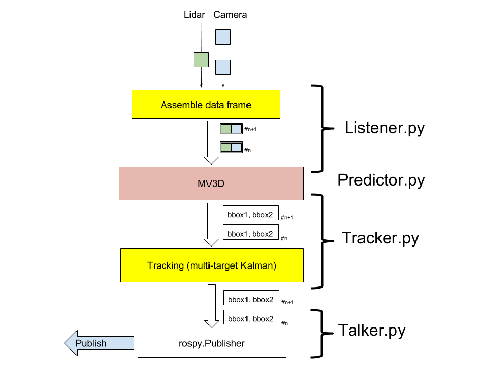
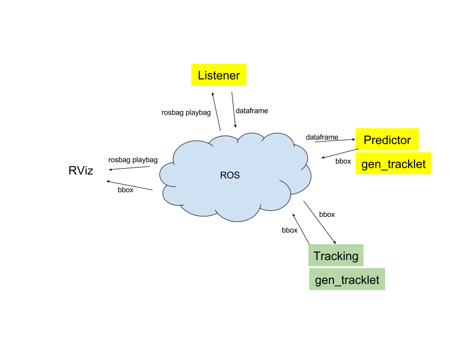

# Function
[Work-In-Progress] This is a skeleton ROS framework to enable real-time processing of ROS bags in Udacity's Didi Chuxing Challenge.

# Overview



# Instructions

* Copy the entire `src` folder to your catkin workspace. For example,
```
cp -r  src ~/catkin_ws/
cd ~/catkin_ws/
```

* Note: Make sure `~/catkin_ws/src/projection/scripts/didiros.py`) is executable. 
Use the command `chmod +x` for this step.

* Build the catkin package
```
catkin_make
source ~/catkin_ws/devel/setup.bash
``` 

# To run

* Terminal 1 (start roscore): 

```roscore```

* Terminal 2 (install and launch [velodyne driver](https://github.com/ros-drivers/velodyne)):

```roslaunch velodyne_pointcloud 32e_points.launch```

* Terminal 3 (play rosbag):

```rosbag play -l [PATH-TO-ROSBAG]```

* Teminal 4 (process data and call MV3D)

```rosrun roslisten didiros.py```

---
# References
Velodyne_points to numpy:
[https://github.com/hengck23/didi-udacity-2017/blob/master/baseline-04/didi_data/ros_scripts/run_dump_lidar.py](https://github.com/hengck23/didi-udacity-2017/blob/master/baseline-04/didi_data/ros_scripts/run_dump_lidar.py
)

image_raw to cv2:
[https://github.com/udacity/didi-competition/blob/master/tracklets/python/bag_to_kitti.py](https://github.com/udacity/didi-competition/blob/master/tracklets/python/bag_to_kitti.py)

Odometry (rtk data) to numpy:
[https://github.com/duburlan/didi_pipeline/blob/master/scripts/cap_to_obs_tf.py](https://github.com/duburlan/didi_pipeline/blob/master/scripts/cap_to_obs_tf.py)

Velodyne Drivers
[https://github.com/ros-drivers/velodyne](https://github.com/ros-drivers/velodyne)
[omgteam/Didi-competition-solution](https://github.com/omgteam/Didi-competition-solution)
